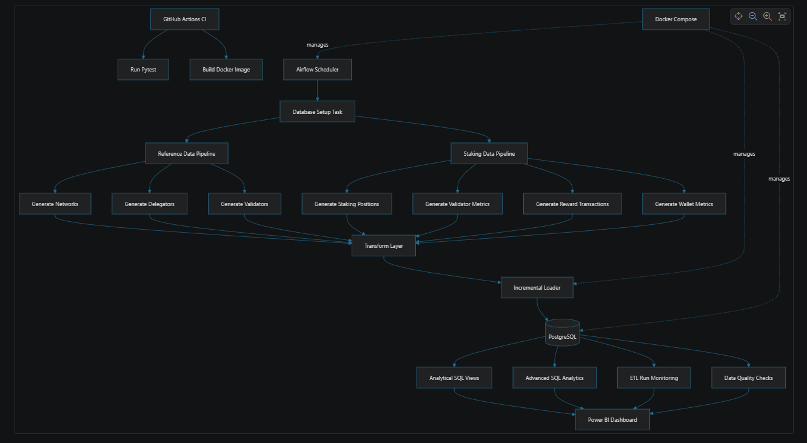
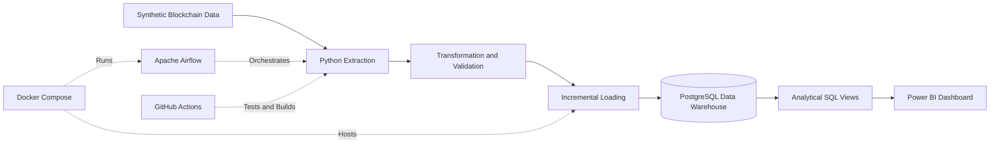
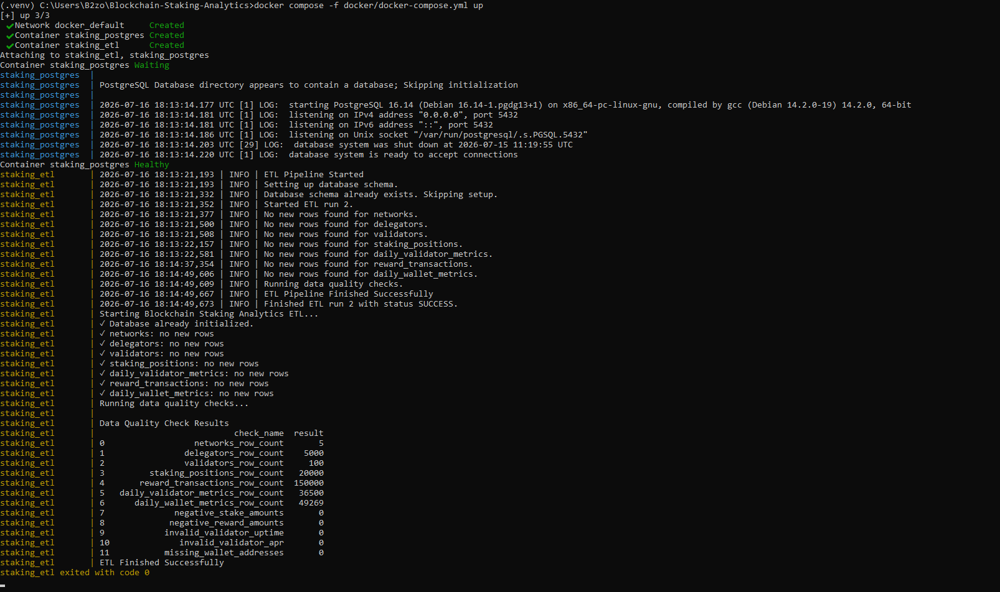
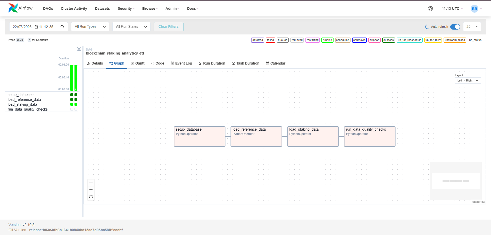
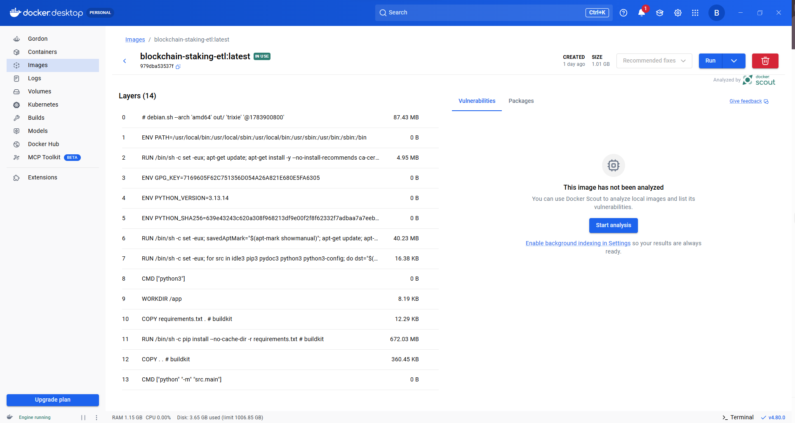
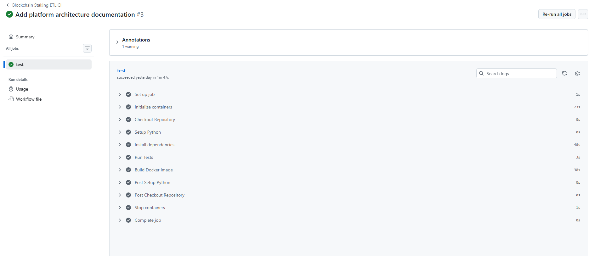

# 🚀 Blockchain Staking Analytics Platform


## Overview

A production-style Data Engineering project that simulates a blockchain staking analytics platform.

The project demonstrates how large-scale blockchain staking data can be extracted, transformed, validated, and loaded into a PostgreSQL data warehouse using an automated ETL pipeline.

The solution incorporates modern Data Engineering practices including:

- Modular ETL architecture
- Incremental loading
- Data quality validation
- Apache Airflow orchestration
- Docker containerization
- PostgreSQL data warehouse
- Automated CI/CD with GitHub Actions
- Unit testing with Pytest
- ETL monitoring and logging

---

# Project Architecture



---

# Data Flow



---

# Technology Stack

| Category | Technology |
|----------|------------|
| Language | Python 3.13 |
| Database | PostgreSQL |
| ETL | Pandas |
| ORM | SQLAlchemy |
| Containerisation | Docker |
| Orchestration | Apache Airflow |
| CI/CD | GitHub Actions |
| Testing | Pytest |
| Visualisation | Power BI |
| Version Control | Git + GitHub |

---

# Project Structure

```text
Blockchain-Staking-Analytics
│
├── config/
├── dags/
├── data/
│
├── docker/
├── docs/
├── logs/
├── src/
│   ├── etl/
│   ├── monitoring/
│   ├── validation/
│   ├── database/
│   └── main.py
│
├── tests/
├── .github/
│   └── workflows/
├── Dockerfile
├── requirements.txt
└── README.md
```

---

# ETL Pipeline

The ETL pipeline consists of four stages.

## 1. Database Setup

Creates all database objects including:

- Fact tables
- Dimension tables
- Views
- Monitoring tables

---

## 2. Reference Data Load

Loads blockchain reference data including:

- Networks
- Delegators
- Validators

Incremental loading prevents duplicate records.

---

## 3. Staking Data Load

Processes:

- Staking Positions
- Validator Metrics
- Reward Transactions
- Wallet Metrics

The pipeline performs data transformations before loading into PostgreSQL.

---

## 4. Data Quality Validation

Automatic quality checks include:

- Missing values
- Duplicate detection
- Invalid APR values
- Negative rewards
- Invalid staking amounts
- Invalid validator uptime
- Missing wallet addresses

Example output:

```
Networks               ✔
Delegators             ✔
Validators             ✔
Positions              ✔
Rewards                ✔
Wallet Metrics         ✔
Negative Rewards       0
Invalid APR            0
Missing Wallets        0
```

---

# Incremental Loading

The ETL supports incremental processing.

Duplicate records are automatically skipped using business keys.

Benefits:

- Faster execution
- Reduced database load
- Idempotent pipeline
- Safe reruns

---

# ETL Monitoring

Each ETL execution records:

- Pipeline Name
- Start Time
- End Time
- Status
- Duration
- Error Message

Example:

| Run | Status |
|------|---------|
| 1 | SUCCESS |
| 2 | SUCCESS |



---

# Apache Airflow

The ETL is orchestrated using Apache Airflow.

Pipeline flow:

```
Setup Database
      ↓
Load Reference Data
      ↓
Load Staking Data
      ↓
Run Data Quality Checks
```



---

# Docker

The application runs inside Docker containers.

Services include:

- PostgreSQL
- ETL Application
- Apache Airflow Scheduler
- Apache Airflow Webserver

Example:

```bash
docker compose up -d
```



---

# Continuous Integration

GitHub Actions automatically performs:

- Dependency installation
- Unit testing
- Docker image build

Workflow triggers on:

- Push
- Pull Request

Workflow status:



---


# Testing

The project uses Pytest.

Current test coverage includes:

- Configuration validation
- Data generation
- Data transformations
- Duplicate removal
- Invalid value handling

Example:

```bash
python -m pytest
```

Result:

```
13 passed
```

---

# Running the Project

Clone repository

```bash
git clone https://github.com/b2zo/Blockchain-Staking-Analytics.git
```

Install dependencies

```bash
pip install -r requirements.txt
```

Run locally

```bash
python -m src.main
```

Run with Docker

```bash
docker compose up -d
```

Run tests

```bash
python -m pytest
```

---

# Sample Pipeline Output

```
ETL Pipeline Started

Database initialized

Networks loaded

Delegators loaded

Validators loaded

Staking Positions loaded

Validator Metrics loaded

Reward Transactions loaded

Wallet Metrics loaded

Running Data Quality Checks...

ETL Finished Successfully
```

---


# Analytical SQL

The project includes

- SQL Views
- Advanced analytical queries
- Reporting datasets
- Dashboard-ready tables

---

# Dashboard

The PostgreSQL analytical views are designed for direct Power BI integration.

Example KPIs include

- Total Staked Amount
- Total Rewards
- Average Validator APR
- Validator Performance
- Wallet Performance
- Daily Reward Trends

---

# Future Improvements

Possible future enhancements include

- Real blockchain APIs
- Streaming ingestion (Kafka)
- dbt transformations
- Terraform infrastructure
- Kubernetes deployment
- Cloud deployment (Azure/AWS/GCP)

---

# Author

Babacar Ba

GitHub:
https://github.com/b2zo

LinkedIn:
https://www.linkedin.com/in/babacar-ba-8264741a0/?skipRedirect=true

