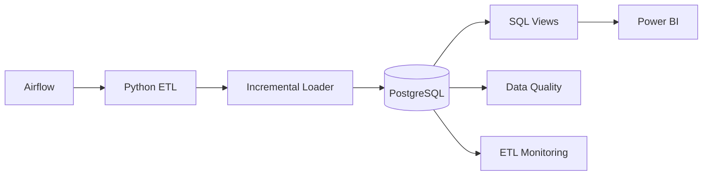

# Blockchain Staking Analytics

End-to-end data analytics project for blockchain staking portfolios, validator performance, reward tracking, APR trends, and concentration risk.

## Project Goal

This project simulates a real-world staking analytics platform used by crypto staking providers, custodians, validators, or Web3 infrastructure companies.

The system ingests staking-related data, stores it in PostgreSQL, creates analytical SQL views, validates data quality, and prepares insights for Power BI dashboards.

## Business Problem

Staking providers need to answer questions such as:

- Which validators generate the highest rewards?
- How does APR change over time?
- Which wallets are most exposed to validator concentration risk?
- Are staking rewards consistent with expected performance?
- Which networks, validators, and delegators require monitoring?

## Architecture

The platform combines Python, PostgreSQL, Docker, Apache Airflow, automated testing, and analytical SQL.




## Project Structure

```text
assets/
config/
dashboards/
data/
docker/
docs/
logs/
notebooks/
sql/
src/
tests/
README.md
requirements.txt

## Features

- Modular ETL pipeline
- Automated data quality checks
- PostgreSQL relational database
- Analytical SQL views
- Docker deployment
- Structured logging
- Error handling
- Executive Power BI dashboards
