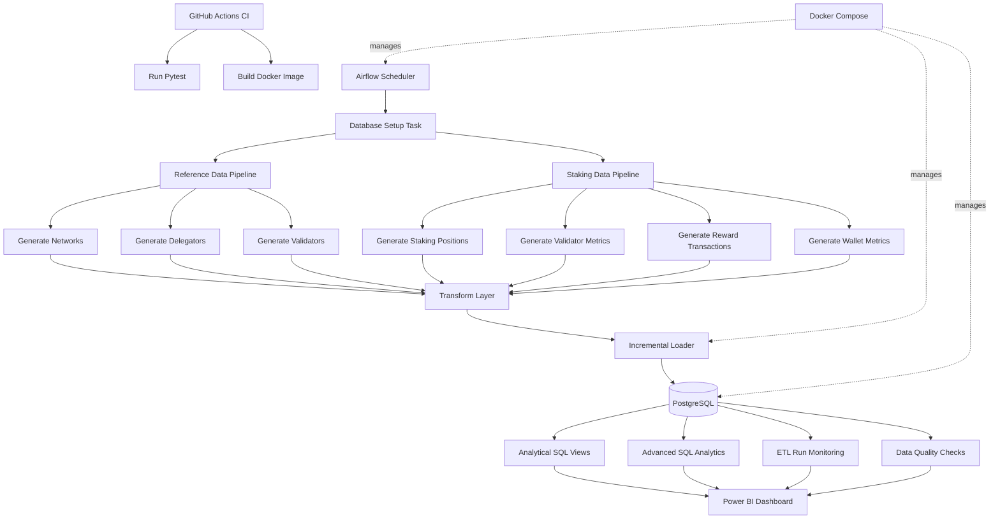

# Blockchain Staking Analytics — Architecture

This project implements a containerised blockchain staking analytics platform with automated orchestration, incremental loading, monitoring, testing, and analytical reporting.

## Data Flow

1. Airflow schedules and orchestrates the pipeline.
2. Synthetic blockchain staking datasets are generated.
3. Transformation functions clean and standardise the records.
4. Incremental loading prevents duplicate records.
5. PostgreSQL stores operational and analytical data.
6. Data quality checks validate important business rules.
7. ETL monitoring records pipeline execution status.
8. SQL views provide reporting-ready datasets.
9. Power BI consumes the analytical views.
10. GitHub Actions automatically runs tests and builds the Docker image.